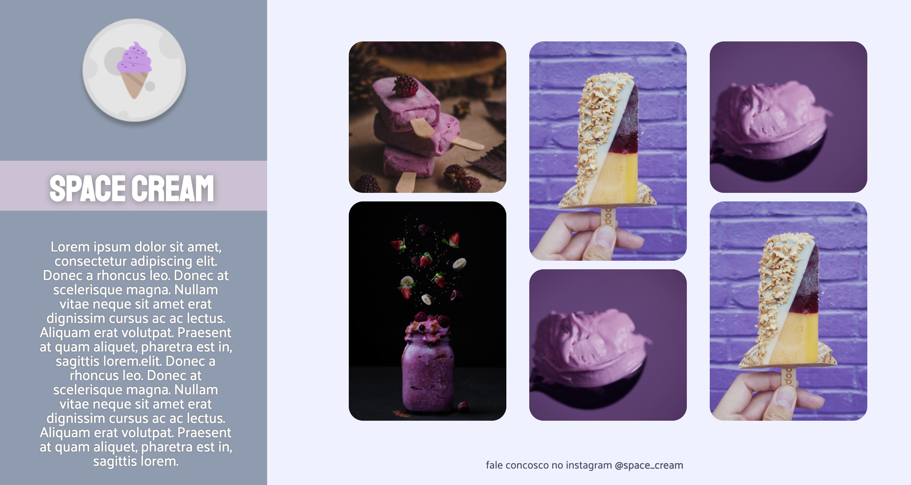

<h1 align="center"> PAGE SPACE CREAMS </h1>

Developed by Ivan Barbosa. 
Layout UX RocketSeat.

  <a href="#-technologies">Technologies</a>&nbsp;&nbsp;&nbsp;|&nbsp;&nbsp;&nbsp;
  <a href="#-project">Project</a>&nbsp;&nbsp;&nbsp;|&nbsp;&nbsp;&nbsp;
  <a href="#-layout">Layout</a>&nbsp;&nbsp;&nbsp;|&nbsp;&nbsp;&nbsp;
  <a href="#memo-license">License</a>

  

 

## 🚀 Technologies

This project was developed with the following technologies:

- HTML
- CSS
- HSL
- JavaScript
- Git e Github

## 💻 Project

ice cream parlor page.

## 🔖 Layout

You can preview the project layout through [from this LINK](https://www.figma.com/file/Pfc2itFEJAxuyvSf9LA4m3/Stage-03---Grid-com-anima%C3%A7%C3%B5es-(Copy)?node-id=0%3A1&t=wMQRrSLZX5BR6RpX-0). It is necessary to have an account on [Figma](https://figma.com) to access it

https://www.rocketseat.com.br/

## 🔖 License

This project is licensed MIT.

---
